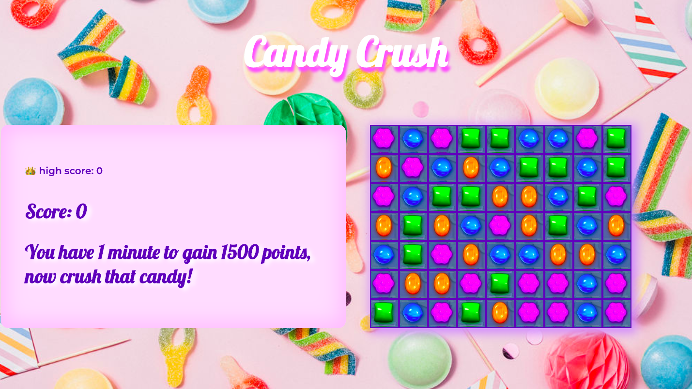

# Candy Crush Replica

This project is a browser game of Candy Crush I built with Vanilla Javascript.

## Built With

1. HTML5
2. CSS
3. Javascript
4. GitHub

## Deployment

The game is deployed on Glitch and it can be found here: https://mialearnstocode-candy-crush.glitch.me/

## Getting Started

Use the clone button to download the game source code. Open the index.html file in your browser and the game should start, if not check console for any issues. The images used in this game are stored in the images folder and are all png files.

## Game Architecture

When the user lands on the game they can choose from a pressure or a strategy mode. In the pressure mode they have a set amount of moves to gain the necessary points. On the other hand, the strategy mode expects the player to reach the needed amount of points within a set amount of moves. 


Candy Crush is a game where players swap colored pieces of candy on a game board to make a match of three or more of the same color in either a row or column. Players can swap any candy on the board as long as it will make a 'crush', so they can't swap two candies if doesn't create a row or column of candies of the same color. New random candies are generated at the top so there is a continuous fall of candy as the user crushes.



In both modes the player can swap out candies in order to crush a row/column of candies of the same color. When the player crushes candy successfully there's a drop function with moves all the candies down and invokes a function which clears the crushed candy. It also invokes a generateCandy function which creates new candies randomly in the top row:

```javascript
  function drop() {
    const cells = document.querySelectorAll('.cell')
    generateCandy()
    for (let i = 0; i < cells.length; i++) {
      const cell = cells[i]
      const b = cells[i + width]
      if (b && !b.classList[1]) {
        b.classList.add(`${cell.classList[1]}`)
        cell.classList.remove(`${cell.classList[1]}`)
      }
    }
    crush()
  }
```

There is a high score feature, so that when the player reaches the minimum score to pass the game the function compares it to the high score saved in local storage. If the score is higher, it gets saved to the local storage: 

```javascript
// function that checks if the player reached the minimum score in the required time
function decrement() {
  timer -= 1
  timeKeeper.innerHTML = `00:${timer}`
  if (timer === 0) {
    clearInterval(interval)
    grid.style.display = 'none'
    if (score > 1500) {
      timeKeeper.innerHTML = 'Congrats, you won! 🎉'
      if (score > highScorePressure) {
        localStorage.setItem('highScorePressure', score)
      }
    } else {
      timeKeeper.innerHTML = 'You ran out of time 🥵'
    }
    clearGrid()
    modeChoice.style.display = 'block'
  }
} 
```


## Challenges and future improvements

The most difficult aspect of this game is to check the whole board after each crush. So that as the candies drop to replace the crushed ones. Also the board should clear any other matches that result from the shift of the pieces not only the ones crushed by the player. I achieved this using a while loop which checks if any cells are left empty from a crush and keeps checking until there aren't any more: 

```
crush()
emptyCheck()
while (emptyCells.length > 0) {
  drop()
  emptyCheck()
} 
```

In terms of future improvements, I want to implement some more levels which increase in difficulty each time the player finishes a level and also add some of the special candies that come with crashing more than 3 candies in one go. 

## Author

Mia Meroi - First Project
Link to portfolio here: miameroi.com
